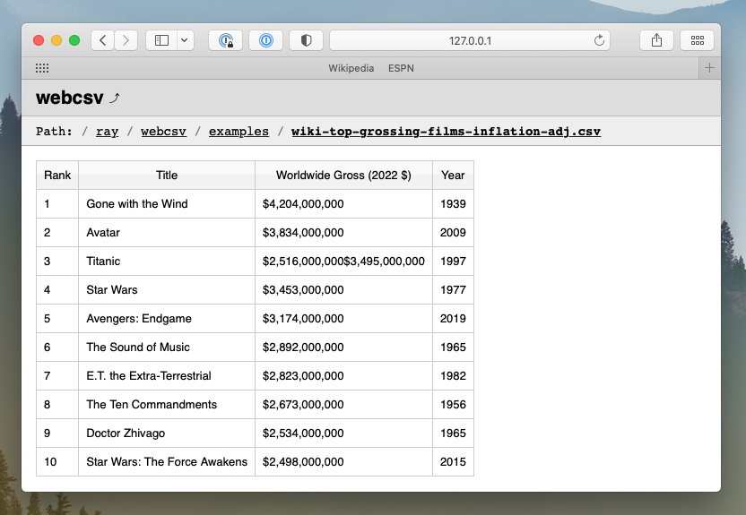

# webcsv: Simple CSV Web Viewer

Simple python web app to view CSV files on the browser. The CSV data will be rendered as an HTML table. This app uses [Flask](https://github.com/pallets/flask) & [Gunicorn](https://github.com/benoitc/gunicorn) with [ryt/runapp](https://github.com/ryt/runapp) for deployment.




## Test/Development Server

Run the app with the default Flask development server on port 5000.

```console
python3 webcsv.py
```

> Note: webcsv has been tested & deployed with Flask version 2.2.5, Python version 3.7.3, and Gunicorn version 21.2.0. Your versions may or may not be compatible so double check your versions if you experience any issues.

## Deployment Instructions (with runapp)

> Note: these instructions are only necessary if you're using [runapp](https://github.com/ryt/runapp) to deploy the application. If you're using gunicorn by itself or are using a custom deployment process, you may skip these instructions.

Create & start a deployment, gunicorn (daemon/process):

```console
cd webcsv
runapp start
```

Stop deployment/app process:

```console
runapp stop
```

Check running deployment/app process:

```console
runapp list
```

Restart deployment/app process:

```console
runapp restart
```

If app is not running after restart, check & re-deploy:

```console
runapp list
runapp start
```

#### Directory Listing Options

By default, webcsv will show a directory listing of any (accessible) directory on the system that is passed to the `f` parameter in the url. To limit the path and set an absoltue parent directory, use the `limitpath` option in `config.py`.

```py
'limitpath' : '/home/user/project/'
```

### Port Notes

1. When deployed with Gunicorn, the app uses port `8002` by default. You can change this by editing `runapp.conf` as well as `webcsv.html`.

2. Flask uses the port `5000` by default for it's development server. Make sure to access the app using that port whenever you're running the flask server.

## Open From Folder

To use webcsv in a particular folder locally, copy `webcsv.html` to that folder and open it. You'll automatically be redirected to webcsv with the path set to that folder.

As mentioned above, you can change the port and path in `webcsv.html` if you have a custom port and path for the app.

### Mac App Notes

You can also create a Mac application named **webcsv.app** to use as the default app to open CSV files with using the following AppleScript. If you change the default port and/or want to use a different browser, make sure to modify the script as well.

```applescript
on open (csvFiles)
	set filePath to POSIX path of item 1 of csvFiles
	tell application "Google Chrome"
		activate
		open location "http://127.0.0.1:8002/webcsv?f=" & filePath
	end tell
end open
```

--

<sub>Copyright &copy; 2024 Ray Mentose.</sub>

