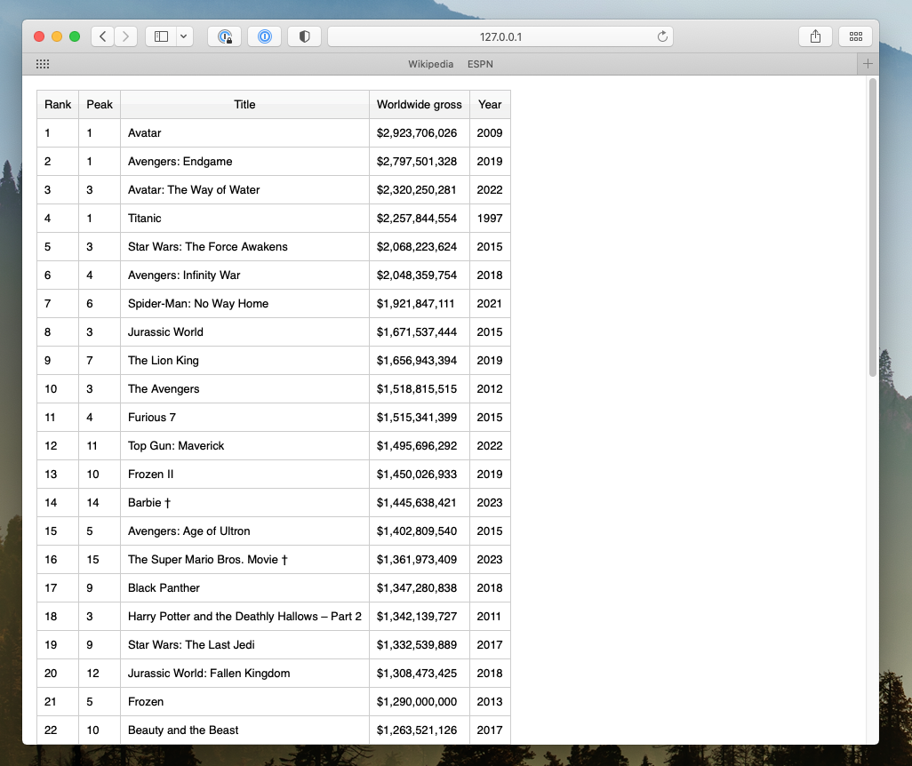

# webcsv: Simple CSV Web Viewer

Simple python web app to view CSV files on the browser. The CSV data will be rendered as an HTML table. This app uses [Flask](https://github.com/flask/flask) & [Gunicorn](https://github.com/gunicorn/gunicorn) with [ryt/runapp](https://github.com/ryt/runapp) for deployment.




## Test/Development Server

Run the app with the default Flask development server on port 5000.

```
$ python3 webcsv.py
```

## Deployment Instructions

Create & start a deployment, gunicorn (daemon/process), with runapp:

```
$ cd webcsv
$ ./runapp start
```

Stop deployment/app process:

```
$ ./runapp stop
```

Check running deployment/app process:

```
$ ./runapp list
```

Restart deployment/app process:

```
$ ./runapp restart
```

If app is not running after restart, check & re-deploy:

```
$ ./runapp list
$ ./runapp start
```

## Open From Folder

To use webcsv in a particular folder locally, copy `webcsv.html` to that folder and open it. You'll automatically be redirected to webcsv with the path set to that folder.

You can change the port and path in `webcsv.html` if you have a custom port and path for the app.

--

<small>Copyright &copy; 2024 Ray Mentose.</small>

